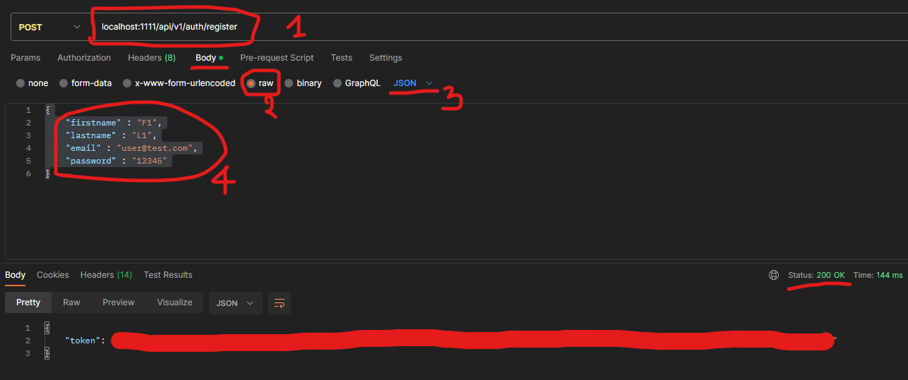
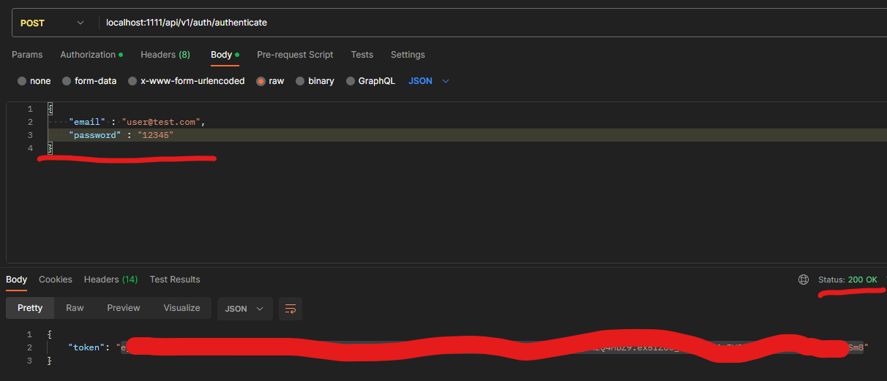
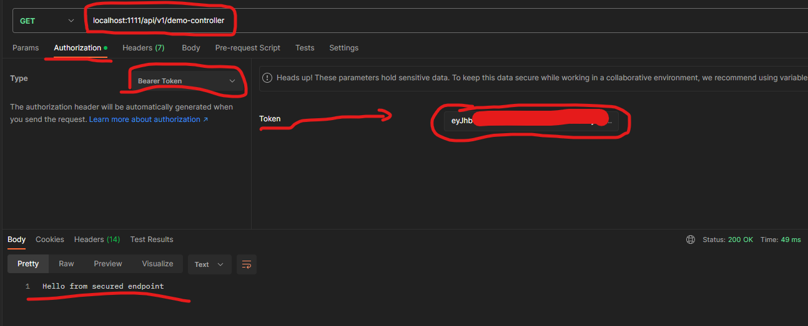

# Spring Security

### References
* [Spring Initializr](https://start.spring.io/)
* [Spring Security](https://docs.spring.io/spring-security/reference/index.html)
* [JWT](https://jwt.io/)
* [Encryption Key Generator ](https://www.allkeysgenerator.com/Random/Security-Encryption-Key-Generator.aspx)

### Configuration of the application.properties file
```yaml
server:
  port: # If you want to change your running port
spring:
  datasource:
    url: # Database connection link
    username: # Database login username
    password: # Database login password
    driver-class-name: # Driver class
  jpa:
    hibernate:
      ddl-auto: update
    show-sql: # If you want to see the schemas
```
```yaml
# ================== OR ================== #
server.port = # If you want to change your running port
spring.datasource.url = # Database connection link
spring.datasource.username = # Database login username
spring.datasource.password = # Database login password
spring.datasource.driver-class-name = # Driver class
spring.jpa.hibernate.ddl-auto = create-drop
spring.jpa.show-sql = # If you want to see the schemas
```

After configuring the application.properties or application.yml file according to your habits, it is time to make some modifications.

Now, let's go to the JwtService.java file and modify the security key [256bits]

### Register
```json
{
  "firstname" : "FUser 1",
  "lastname" : "LUser 1",
  "email" : "user1@test.com",
  "password" : "password"
}
```


### Authentication
```json
{
  "email" : "user1@test.com",
  "password" : "password"
}
```


### Demo
```shell
Hello from secured endpoint  # Output
```


## Thank you ! 
